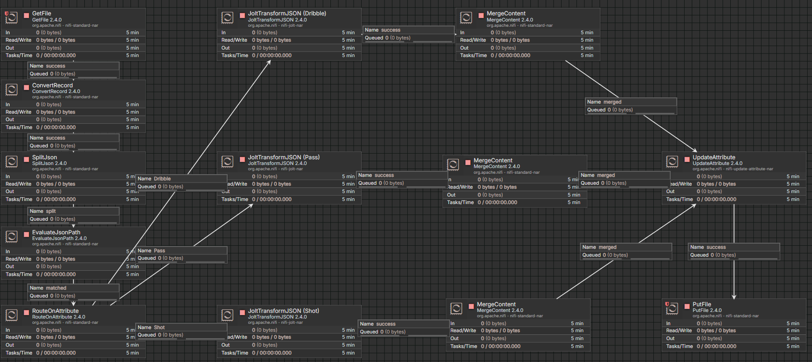

# Apache NiFi Data Pipeline Project
## Overview

This repository contains a simple data pipeline built with **Apache NiFi**.<br>
It demonstrates how to ingest, transform, and route data using NiFi’s low-code interface.

## Objectives

The main objectives of this project are to:

- Showcase a basic NiFi flow from source to destination
- Demonstrate data transformation and routing techniques
- Provide a reusable template for similar ETL/ELT scenarios

## Repository Structure
```
Nifi-Data-Flow
|-- imgs
|   |-- Flow.png
|-- Source
|   |-- Europe - Champions League.csv
|   |-- United States of America - Major League Soccer.csv
|-- Target
|   |-- Dribble_20250524_164254.json
|   |-- Pass_20250524_164249.json
|   |-- Pass_20250524_164259.json
|   |-- Shot_20250524_164254.json
|-- .gitignore
|-- NiFi_Flow.json
|-- README.md
```


## Pipeline Components



### Input Stage
- **GetFile**: Reads the raw JSON file from the `Source` directory.
- **ConvertRecord**: Ensures proper JSON format (if needed).

### Splitting and Routing
- **SplitJson**: Breaks down JSON arrays into individual records.
- **EvaluateJsonPath**: Extracts the `type` field from each JSON record.
- **RouteOnAttribute**: Routes each event based on its type (Shot, Pass, Dribble).

### Transformation
- **JoltTransformJSON (Dribble / Pass / Shot)**: Each processor applies a custom JOLT spec to format the JSON structure per event type.

### Merging
- **MergeContent (x3)**: Recombines processed flow files by type into grouped documents.

### Finalization
- **UpdateAttribute**: Updates filenames.
- **PutFile**: Writes the final output to the `Target` directory.

## Data Source

This project uses data from the [StatsBomb Open Data](https://github.com/statsbomb/open-data) repository.

- Events from **UEFA Champions League final matches**
- Events from **MLS matches** (Inter Miami)

The raw data is pre-extracted and included in the repository under the `Source` folder as example files to demonstrate the full data flow.

## Requirements

- Apache NiFi 2.4.0+
- Java 11+
- Internet browser for accessing NiFi UI

## How to Use

1. Clone this repository.
2. Open Apache NiFi and upload the `NiFi_Flow.json` template.
3. Update the paths in:
   - `GetFile` → Source folder
   - `PutFile` → Target folder
4. Start all processors.
5. Check the `Target/` folder for output files.

## References

- [StatsBomb Open Data](https://github.com/statsbomb/open-data)
- [Apache NiFi Documentation](https://nifi.apache.org/docs.html)
- [JOLT Specification Language](https://github.com/bazaarvoice/jolt)

## Author

Anis Guechtouli

## Contact

For any questions or suggestions, feel free to contact me at <mailto:guechtoulianiss7@gmail.com>.

## Example JSON Mapping

<table style="width:100%; border-collapse: collapse;">
  <thead>
    <tr>
      <th style="width:50%; text-align:center; border-bottom: 1px solid #ddd; padding: 8px;">
        Source
      </th>
      <th style="width:50%; text-align:center; border-bottom: 1px solid #ddd; padding: 8px;">
        Target
      </th>
    </tr>
  </thead>
  <tbody>
    <tr>
      <td style="vertical-align: top; padding: 8px;">
        <pre><code class="language-json">"50_50" : null,
"ball_receipt_outcome" : null,
"ball_recovery_recovery_failure" : null,
"carry_end_location" : null,
"clearance_aerial_won" : null,
"counterpress" : null,
"dribble_nutmeg" : null,
"dribble_outcome" : "Complete",
"dribble_overrun" : null,
"duel_outcome" : null,
"duel_type" : null,
"duration" : "0.0",
"foul_committed_advantage" : null,
"foul_committed_card" : null,
"foul_won_advantage" : null,
"foul_won_defensive" : null,
"goalkeeper_body_part" : null,
"goalkeeper_end_location" : null,
"goalkeeper_outcome" : null,
"goalkeeper_position" : null,
"goalkeeper_technique" : null,
"goalkeeper_type" : null,
"id" : "0f041a66-205d-4fdb-ba0d-95f5b3709fd3",
"index" : "256",
"interception_outcome" : null,
"location" : "[61.9, 21.9]",
"match_id" : "3877060",
"minute" : "4",
"pass_aerial_won" : null,
"pass_angle" : null,
"pass_assisted_shot_id" : null,
"pass_backheel" : null,
"pass_body_part" : null,
"pass_cross" : null,
"pass_cut_back" : null,
"pass_deflected" : null,
"pass_end_location" : null,
"pass_goal_assist" : null,
"pass_height" : null,
"pass_length" : null,
"pass_outcome" : null,
"pass_recipient" : null,
"pass_recipient_id" : null,
"pass_shot_assist" : null,
"pass_switch" : null,
"pass_type" : null,
"period" : "1",
"play_pattern" : "From Throw In",
"player" : "Lucas Lima Linhares",
"player_id" : "23304.0",
"position" : "Left Midfield",
"possession" : "12",
"possession_team" : "New York Red Bulls",
"possession_team_id" : "387",
"related_events" : "['696db2b0-dbb9-4854-92c6-1d979e2f5dec']",
"second" : "16",
"shot_aerial_won" : null,
"shot_body_part" : null,
"shot_end_location" : null,
"shot_first_time" : null,
"shot_freeze_frame" : null,
"shot_key_pass_id" : null,
"shot_one_on_one" : null,
"shot_outcome" : null,
"shot_statsbomb_xg" : null,
"shot_technique" : null,
"shot_type" : null,
"substitution_outcome" : null,
"substitution_outcome_id" : null,
"substitution_replacement" : null,
"substitution_replacement_id" : null,
"tactics" : null,
"team" : "New York Red Bulls",
"team_id" : "387",
"timestamp" : "2025-02-02T00:04:16.310+01:00",
"type" : "Dribble",
"under_pressure" : "true",
"competition" : "United States of America - Major League Soccer",
"season" : "2023",
"block_offensive" : null,
"foul_committed_offensive" : null,
"foul_committed_type" : null,
"injury_stoppage_in_chain" : null,
"pass_miscommunication" : null,
"pass_technique" : null,
"pass_through_ball" : null,
"block_deflection" : null,
"ball_recovery_offensive" : null,
"foul_committed_penalty" : null,
"foul_won_penalty" : null,
"shot_open_goal" : null,
"shot_redirect" : null,
"bad_behaviour_card" : null,
"block_save_block" : null,
"shot_deflected" : null,
"miscontrol_aerial_won" : null,
"clearance_body_part" : null,
"clearance_head" : null,
"clearance_left_foot" : null,
"clearance_right_foot" : null,
"goalkeeper_punched_out" : null,
"off_camera" : null,
"out" : null,
"pass_inswinging" : null,
"pass_outswinging" : null,
"pass_straight" : null,
"goalkeeper_shot_saved_to_post" : null,
"pass_no_touch" : null,
"shot_saved_to_post" : null,
"goalkeeper_success_in_play" : null,
"clearance_other" : null,
"player_off_permanent" : null,
"goalkeeper_shot_saved_off_target" : null,
"shot_saved_off_target" : null,
"shot_follows_dribble" : null,
"dribble_no_touch" : null,
"goalkeeper_lost_out" : null,
"half_start_late_video_start" : null,
"goalkeeper_lost_in_play" : null,
"goalkeeper_penalty_saved_to_post" : null,
"goalkeeper_saved_to_post" : null,
"goalkeeper_success_out" : null
</code></pre>
      </td>
      <td style="vertical-align: top; padding: 8px;">
        <pre><code class="language-json">"id" : "0f041a66-205d-4fdb-ba0d-95f5b3709fd3",
"index" : 256,
"match_id" : 3877060,
"team_id" : 387,
"team" : "New York Red Bulls",
"competition" : "United States of America - Major League Soccer",
"season" : "2023",
"player_id" : 23304,
"player" : "Lucas Lima Linhares",
"position" : "Left Midfield",
"possession" : 12,
"location" : "[61.9, 21.9]",
"period" : 1,
"minute" : 4,
"second" : 16,
"duration" : 0.0,
"play_pattern" : "From Throw In",
"dribble_nutmeg" : false,
"dribble_outcome" : "Complete",
"dribble_overrun" : false,
"under_pressure" : true,
"out" : false
</code></pre>
      </td>
    </tr>
  </tbody>
</table>
